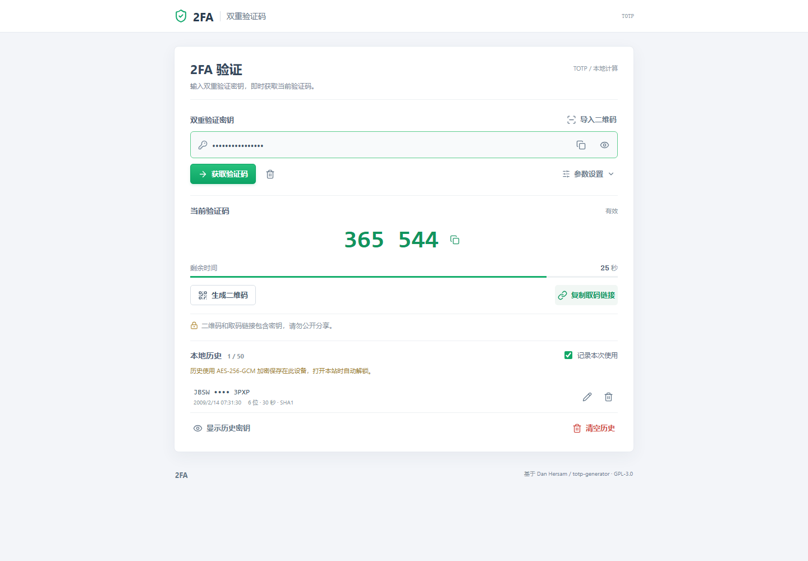
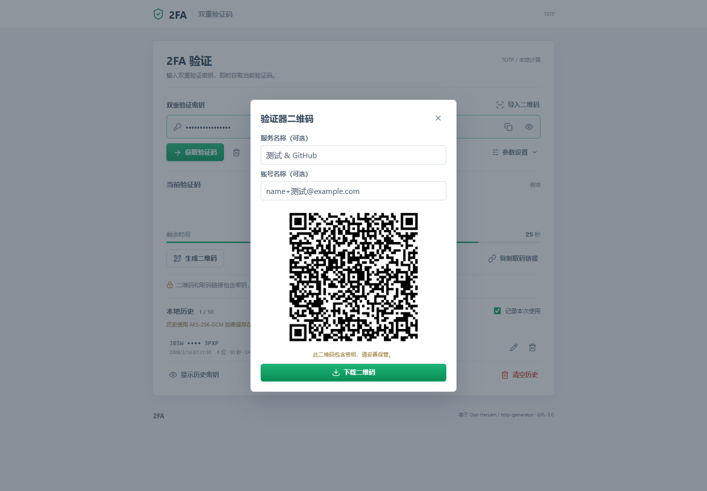
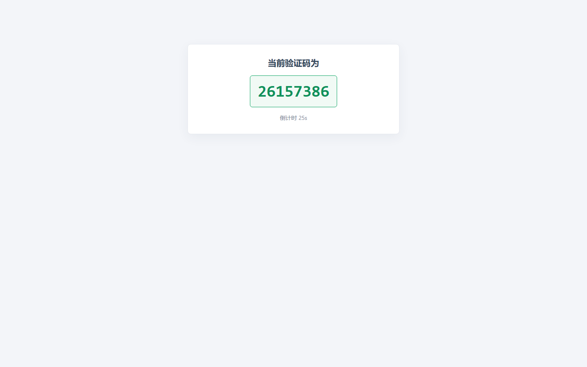

<div align="center">

# Rulio 2FA

本地运行的 TOTP 双重验证码工具

[](https://2fa.rulio.top)
[](https://2fa.rulio.top)
[](https://www.rfc-editor.org/rfc/rfc6238)
[](#功能)
[](#本地运行)
[](LICENSE)

[在线使用](https://2fa.rulio.top) · [功能说明](#功能) · [部署说明](#部署)

</div>

基于 Dan Hersam 的 [jaden/totp-generator](https://github.com/jaden/totp-generator)
修改，保留 GPL-3.0 许可证和原作者署名。2026-09-05 修改：
中文界面、输入校验、二维码生成/下载、路径链接兼容、复制与清空、测试和静态构建。

## 界面预览

### 验证码与本地历史



### 验证器二维码



### 简洁直链取码



## 本地运行

需要 Node.js 22 或以上。

```sh
npm ci
npm run build
npm start
```

终端输出本地地址，默认 `http://127.0.0.1:4173`，端口占用时自动换用下一端口。
仅监听本机。修改代码后重新运行 `npm run build` 并刷新页面。
请勿直接部署 `public` 或通过双击 HTML 使用；实际可部署产物为 `dist`。

## 功能

- 输入 Base32 密钥生成 TOTP，默认 SHA1 / 6 位 / 30 秒。
- 支持 6/7/8 位、5 至 300 秒和 SHA1/SHA256/SHA512。
- 显示剩余时间，到期刷新，切回页面立即重新计算。
- 复制验证码、生成本地验证器二维码、下载 PNG。
- 导入二维码图片，提取并复制密钥，同时恢复服务、账号、算法、周期和位数。
- 支持单账号 `otpauth://totp/`、纯 Base32 密钥和上述取码链接二维码。
  不支持 HOTP 或 Google Authenticator 批量迁移码。
- 图片识别在本地 Worker 中完成，不上传；单张图片上限 10 MB、4000 万像素。
- 服务和账号名称可选，二维码为 `otpauth://totp/…`，不是网站链接。
- 默认隐藏密钥；修改输入后清除旧验证码，避免复制错账号。
- 首页本地历史默认记录成功取码，最多 50 条，按最近使用排序，同一密钥和参数去重。
  可取消“记录本次使用”，暂停本页后续记录；刷新后恢复默认。支持恢复取码、单条删除、
  显示/隐藏密钥和确认清空。历史使用 AES-256-GCM 加密，密文保存于 localStorage，
  非导出设备密钥保存于 IndexedDB，打开本站时自动解锁，不上传。
  该免密码方案避免在 localStorage 及其备份中直接出现明文，但不能防御同源恶意脚本、
  可访问页面的浏览器扩展、恶意软件或已被控制的浏览器配置文件。清除站点数据或丢失
  IndexedDB 设备密钥后，加密历史无法恢复。
  清空输入框不删除历史，清空历史也不会清空当前输入框。
- 历史记录右侧的铅笔按钮可编辑服务名称、账号 ID（各最多 64 字符）和备注
  （最多 200 字符）。这些信息随历史保存在当前浏览器，再次取码不会覆盖；
  清空历史会一起删除。密钥和验证码参数不能在编辑框中修改。
- 直链简洁页不新增历史记录，不使用 sessionStorage、Cookie 或数据库。
- 所有运行时依赖随站点部署，不调用外部验证码或二维码接口。

## 取码链接

以下示例密钥是公开测试数据，不要用来保护真实账号。

```text
https://your-domain.example/#/JBSWY3DPEHPK3PXP
https://your-domain.example/2fa/JBSWY3DPEHPK3PXP
https://your-domain.example/?key=JBSWY3DPEHPK3PXP
https://your-domain.example/#secret=JBSWY3DPEHPK3PXP
https://your-domain.example/?digits=8&period=60&algorithm=SHA256#/JBSWY3DPEHPK3PXP
```

`/2fa/密钥` 显示独立简洁页面：验证码、倒计时、点击验证码复制，保留路径地址。
“复制取码链接”默认复制这种路径直链，自定义算法/周期/位数保留在查询参数。
片段链接仍打开完整工具页面；查询密钥链接读取后转为片段链接。
这无法撤销首次请求已将路径/查询密钥发送给服务器的事实。
网址和二维码都包含完整密钥，任何持有者都能取码。片段不会作为 HTTP
请求路径发送，但仍可能出现在浏览器历史、剪贴板、截图和扩展读取范围内。
不要公开分享，不要在公共设备使用真实密钥。清空页面不会清除系统剪贴板
或已有浏览器历史，也不会撤销之前分享的密钥。

## 部署

将 `dist` 的内容部署到网站根目录，启用 HTTPS。不需要数据库或 Node 服务。
不支持部署到 `/project/` 这样的子目录。

### Nginx / 宝塔

构建后上传 `dist`，网站运行目录指向该文件夹。参考 `deploy/nginx.conf`：
替换域名和目录，在宝塔或反向代理中配置 HTTPS，合并配置而不是覆盖现有站点。
其中 `/2fa/` 回退到 `index.html` 是路径链接直接访问和刷新所必需的。
示例仅为配置模板，尚未在实际 Nginx 服务器执行验证。

示例关闭访问日志，但上游 CDN、代理和平台仍可能记录 URL。
建议仅使用片段链接；不要把服务器日志策略当作密钥保护机制。

### 静态托管

构建命令 `npm run build`，发布目录 `dist`。
产物内的 `_redirects` 和 `_headers` 供支持这些文件的平台使用：
`/2fa/*` 回退到 `/index.html`。其他平台需要自行设置同等重写规则。
不支持回退的平台可使用 `/#/密钥` 形式。

## 验证

```sh
npm test
npx playwright install chromium
npm start
# 在另一个终端运行；如端口变化，先设置 PREVIEW_URL。
npm run test:browser
```

单元测试包含 RFC 6238 三种算法的 18 个标准向量、校验、链接和二维码解码。
浏览器测试使用公开测试密钥，检查实际页面、二维码 PNG 解码、复制、
链接、时间切换、错误状态、本地历史与无外部请求及桌面/手机布局。
截图和测试二维码输出在被 Git 忽略的 `test-results`。
自动解码不等同于已经用实体手机上的各款验证器逐一扫码测试。

原版说明保留于 `Readme.md`，完整许可证在 `LICENSE`。
